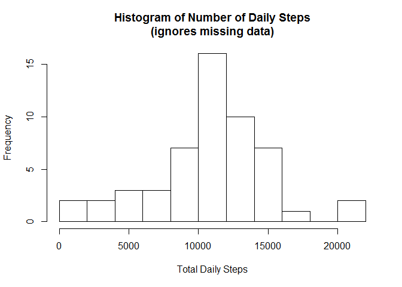
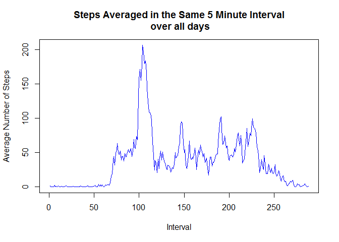
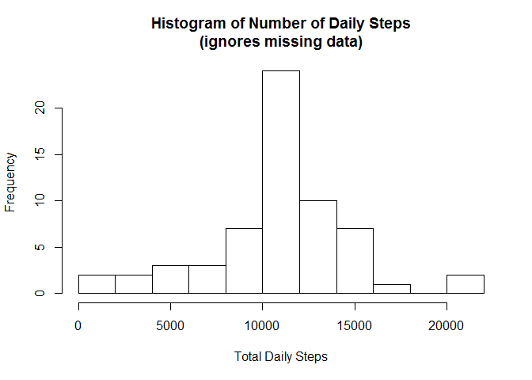
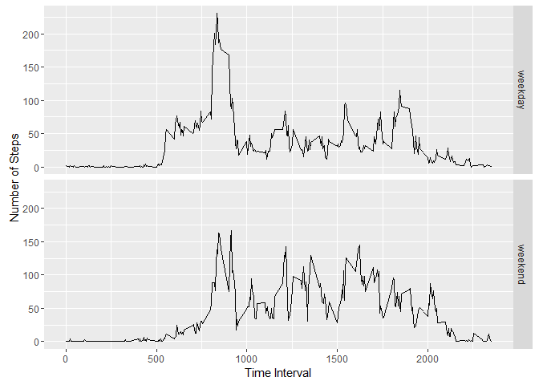

# Reproducible Research: Peer Assessment 1


## Loading and preprocessing the data

```r
library(ggplot2)
library(chron)
```

```
## Warning: package 'chron' was built under R version 3.2.5
```

```r
unzip("activity.zip", "activity.csv")
activity_data <- read.csv("activity.csv", sep=",", header=T)
unlink("activity.csv")
```


The data are loaded into the variable **activity_data** which consists of 3 columns **(steps, date, interval)** and **17568** rows (observations)


```r
daily_steps <-aggregate(steps ~ date, data=activity_data,  sum, na.rm=TRUE)
h <- hist(daily_steps$steps, xlab="Total Daily Steps", main="Histogram of Number of Daily Steps\n(ignores missing data)", breaks=10)
```

<!-- -->


## What is mean total number of steps taken per day?


```r
options(scipen = 1, digits = 0)
info <- summary(daily_steps$steps, digits=10)
```

The mean of the total steps each day is **10766**

The median of the total steps each day is **10765**


## What is the average daily activity pattern?

```r
time_steps <-aggregate(steps ~ interval, data=activity_data,  mean, na.rm=TRUE)
plot(time_steps$steps,  type="l", xlab="Interval", ylab="Average Number of Steps",
     main="Steps Averaged in the Same 5 Minute Interval\n over all days", col="blue")
```

<!-- -->

```r
interval_row_with_max_steps <- which.max(time_steps$steps)
interval_label_with_max_steps <-time_steps[which.max(time_steps$steps),1]
max_steps <- time_steps[which.max(time_steps$steps),2]
```

The time interval with the maximum number of steps is in row **104**

This corresponds to the interval numbered **835** with **206** steps

## Imputing missing values

```r
 number_missing_rows <- sum(is.na(activity_data$steps))
```

There are **2304** missing values in the dataset.

We will replace the missing data with the average data from the corresponding time periods for days that are not missing that data.


```r
# Repeat the interval averages 61 times, corresponding to 31 days in OCT + 30 days in NOV
mean_time_steps<- do.call("rbind", replicate(61, time_steps, simplify = FALSE))
mean_time_steps$interval <- NULL  # drop the interval column for this table
# Add this column of average steps to original data
activity_data <- cbind(activity_data, mean_time_steps) 
names(activity_data)[4] <- c("Average.Steps")
activity_data$steps <- 
    ifelse(is.na(activity_data$steps), activity_data$Average.Steps, activity_data$steps)
```


```r
daily_steps <-aggregate(steps ~ date, data=activity_data,  sum, na.rm=TRUE)
h <- hist(daily_steps$steps, xlab="Total Daily Steps", main="Histogram of Number of Daily Steps\n(ignores missing data)", breaks=10)
```

<!-- -->


```r
options(scipen = 1, digits = 0)
info <- summary(daily_steps$steps, digits=10)
```

The new mean of the total steps each day is **10766**

The new median of the total steps each day is **10766**

Therefore, the particular way that I used to replace the missing values changed the median by 1, but did not change the mean. Using another method, however, might have produced different results.


## Are there differences in activity patterns between weekdays and weekends?


```r
# create a new, boolean column
activity_data$weekend <- chron::is.weekend(activity_data$date)
#change it to a factor
activity_data$weekend <- ifelse(activity_data$weekend, "weekend", "weekday")
activity_data$weekend <- as.factor(activity_data$weekend)
# aggregate the data by interval and weekend
step_data <-aggregate(steps ~ interval + weekend, data=activity_data,  mean)

ggplot(data = step_data, 
      aes(x = interval, y = steps) ) + 
      geom_line() +
      facet_grid(facets = weekend ~ .) +
      xlab("Time Interval") +
      ylab("Number of Steps")
```

<!-- -->
